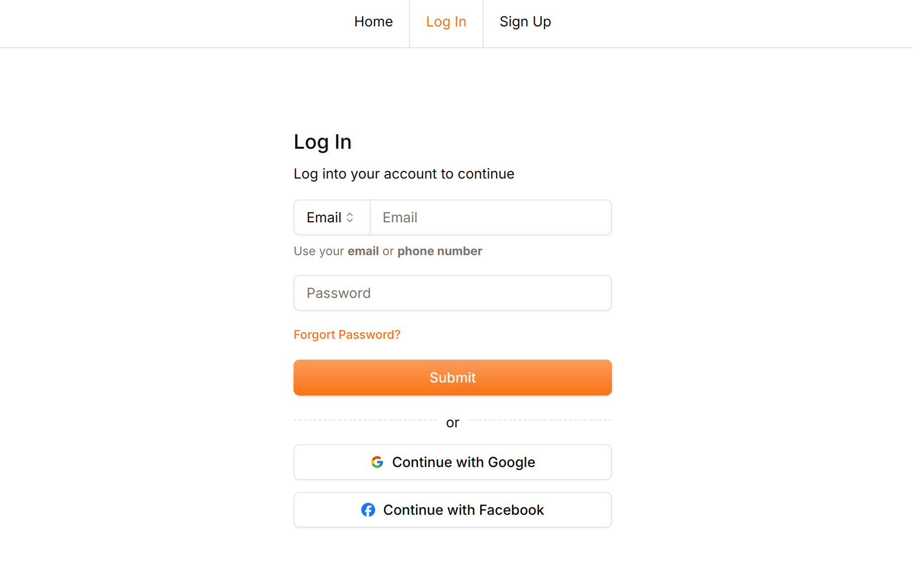

<div style="display: flex; flex-wrap: wrap; justify-content: center; align-items: center; gap: 16px; text-align: center; margin: 0 auto; width: fit-content;">
<picture>
        <source media="(prefers-color-scheme: dark)" srcset="./public/next-light.svg">
        
    </picture>
    
    
    
    <span style="font-weight: 600;">shadcn/ui</span>
    <span style="font-weight: 300;">ArcticJS</span>
    <picture>
        <source media="(prefers-color-scheme: dark)" srcset="https://resend.com/static/brand/resend-icon-white.png">
        
    </picture>
    
</div>
<span style="border-bottom: 1px solid"></span>
<h1 style="font-weight: 300" align="center">
  NextJS Authentication boilerplate with: Neon, Postgress, Typescript, ArcicJS, Resend, Twilio and Shadcn Components
</h1>



## Getting Started

### Environment Variables
To get started, you need to create a `.env` file in the root of the project. Add all the environment variables: <br>
Below are the environment variables and where you can get them

```env
DOMAIN="http://localhost:3000"
```

Get a `DATABASE_URL` by following the following instructions: [Neon Database URL](https://neon.tech/docs/connect/connect-from-any-app).
```env
DATABASE_URL=
```

Generate a `JWT_SECRET` in linux or MAC by typing the following in your terminal `openssl rand -base64 32`. 

Alternatively, you can get one online in the following site: [Generate random string for a JWT Secret](https://codebeautify.org/generate-random-string)

```env
JWT_SECRET=
```

Create a `RESEND_API_KEY` by following this link: [Create Resend API key](https://resend.com/api-keys)
```env
RESEND_API_KEY=
```

Get a google `GOOGLE_CLIENT_ID` and `GOOGLE_SECRET` by following the following instructions: [Get google client id and secret](https://www.balbooa.com/help/gridbox-documentation/integrations/other/google-client-id)
```env
GOOGLE_CLIENT_ID=
GOOGLE_SECRET=
```
Get the facebook `FACEBOOK_APP_ID` and `FACEBOOK_APP_SECRET` by following the following instructions: [Get facebook app id and app secret](https://theonetechnologies.com/blog/post/how-to-get-facebook-application-id-and-secret-key)

```env
FACEBOOK_APP_ID=
FACEBOOK_APP_SECRET=
```

Get the twilio `TWILIO_ACCOUNT_SID` and `TWILIO_AUTHENTICATION_TOKEN` by following these instructions: [Get twilio account side and authentication token](https://help.twilio.com/articles/14726256820123)
```env
TWILIO_ACCOUNT_SID=
TWILIO_AUTHENTICATION_TOKEN=
```
 [Follow these instructions](https://help.twilio.com/articles/360033309133) to create a `TWILIO_2FA_SERVICE_ID` for the Verify API.
```env
TWILIO_2FA_SERVICE_ID=
```

At the end of it all your `.env` file should look like this
```env
DOMAIN="http://localhost:3000"
DATABASE_URL=your_database_url
JWT_SECRET=your_jwt_secret
RESEND_API_KEY=your_resend_api
GOOGLE_CLIENT_ID=your_google_client_id
GOOGLE_SECRET=your_google_secret
FACEBOOK_APP_ID=your_facebook_api_id
FACEBOOK_APP_SECRET=your_facebook_app_secret
TWILIO_ACCOUNT_SID=your_twilio_account_sid
TWILIO_AUTHENTICATION_TOKEN=your_twilio_autentication_token
TWILIO_2FA_SERVICE_ID=your_twilio_service_id_for_the_verify_service
```

### Installation of dependencies
```bash
#based on your package manager
npm install
#or
yarn install
#or
pnpm install
#or
bun install
```

### Running the project
```bash
#based on your package manager
npm run dev
# or
yarn dev
# or
pnpm dev
# or
bun dev
```

Open [http://localhost:3000](http://localhost:3000) with your browser to see the result.

## The Flow
### Sign Up flow (email and password) - `/actions/signup.ts`
The sign up flow, works as follows:

1. Once the user submits the data, we validate it: We use [zod](https://www.zod.dev) for validation.

```typescript
const isValid = SignUpSchema.safeParse(data);

// return error if not valid
if (!isValid.success) return { error: 'The data provided is invalid!' };
```

2. If the data doesn't have a code we add them to our DB and then we send them a code and return them to the sign up page for them to add the code to the form.

* Check if the user we are trying to add is in our DB

```typescript
// check if the user already exists
  const exisitingUser = await getUserByEmailOrTelephone({ email, telephone });
  if (exisitingUser) {
    if (email) return { error: 'Email already in use!' };
    if (telephone) return { error: 'Phone number already in use!' };
  }
```

* We add them to the DB

```typescript
try {
    // insert data to db
    const fullName = `${firstName} ${lastName}`;
    const hash = bcrypt.hashSync(password, 12);

    await db.user.create({
      data: { fullName, email, telephone, password: hash },
    });
  } catch (error) {
    return {
      error: 'An error occured on our side, please try signing up again',
    };
  }
```
* We send them the code
```typescript
    if (telephone) {
      //  send them a code if they used their phone
      //  send them to the sign up page with the data they had given us
    }

    if (email) {
      // send them a code if they used their email
      //  send them to the sign up page with the data they had given us
    }
```

3. We check if the data includes a code for verifying their contact (**phone** or **email**) and if so we verify their contact before proceeding.
   
```typescript
  if (code) {
    if (telephone) {
      // verify the phone number code if they used their phone for verification
    }

    if (email) {
      // verify the email code if they used their email for verification
    }
  }
```

### Login flow (email and password) - `/actions/login.ts`
The login flow works as follows:

1. Once the user submits the data, we validate it using [zod](https://www.zod.dev).

```typescript
  const isValid = LogInSchema.safeParse(data);

  if (!isValid.success) return { error: 'The data provided in invalid!' };
```

2. We look up the user, and if we do not have a user, we return an error
```typescript
  // look up the user
  const existingUser = await getUserByEmailOrTelephone({ email, telephone });

  // return error if we have no user in the DB
  if (!existingUser)
    return { error: 'Invalid username or password, try again!' };
```

1. We check if the user has been verified, if not we verify them. Here we repeat the process we went through in the sign up server action just in case they skipped the verification part.
   
2. We go through a similar process of verification but now, only if the user has 2FA enabled in their settings.
```typescript
    // check if the user has 2FA enabled
  if (existingUser.isTwoFactorEnabled) {
    // check if they have given us the code, so that we can verify it
    // if they do not have a code, send it to them so that we can verify them 
  }
```
1. Compare if passwords match
```typescript
// compare if passwords match
  const passwordsMatch = bcrypt.compareSync(
    password,
    existingUser.password || '',
  );

  // return error if passwords don't match
  if (!passwordsMatch) return { error: 'Invalid email or password' };
```

6. Create a session once the user is authenticated
```typescript
  // add the tokens to the HTTP-only cookie
  await createSession({
    userId: existingUser.id,
    userRole: existingUser.role,
    _v: existingUser.refreshTokenVersion,
  });
```

7. We return the user we just created to the frontend so that they can be persisted in the state

### Login flow (google oAuth) - `/app/api/auth/google/route.ts`
1. Arctic abstracts some of the processes for us, but in a very simple way so that we can still tell what's going on. 
* First, we start by creating a url that we will redirect the user to in the oAuth provider. In google that is as shown below. It's also good to note that google oAuth has PKCE *(pronounced pixy)*, which is an extra layer of security. We won't be dwelling on that a lot. 
  ```typescript
   const url = await google.createAuthorizationURL(state, codeVerifier, {
    scopes: ['email', 'profile'], //open id connect is already added in this scope by Arctic
  });
  ```
* We then redirect the user to that URL and the user get's to choose whether they want to give our app that access to their data. If they choose YES, we continue:
```typescript
  //   store state verifier as cookie
  cookies().set('state', state, {
    secure: process.env.NODE_ENV === 'production',
    path: '/',
    httpOnly: true,
    maxAge: 10 * 60, // 10 minutes
  });

  //   store code verifier as cookie
  cookies().set('code_verifier', codeVerifier, {
    secure: process.env.NODE_ENV === 'production',
    path: '/',
    httpOnly: true,
    maxAge: 10 * 60, // 10 minutes
  });

return NextResponse.redirect(url);
```
* At this point, the user is in the google website, accepting to give us these rights, after which they are sent back to our site with a positive response or a negative response based on their willingness to give our site the data. They are redirected to the callback url we gave google in this case `/api/auth/callback/google/route.ts` in the `/app` directory.

* We create a GET route in the callback URL that google will call
```typescript
export const GET = async (req: NextRequest) => {
  
};
```
* We then go ahead and validate the code and state we sent to google to ensure they are the ones we sent:
```typescript
const searchParams = req.nextUrl.searchParams;
  const code = searchParams.get('code');
  const state = searchParams.get('state');

  const storedState = cookies().get('state')?.value ?? null;
  const codeVerifier = cookies().get('code_verifier')?.value ?? null;
  const Location = '/dashboard';

  if (
    !code ||
    !state ||
    !storedState ||
    !codeVerifier ||
    state !== storedState
  ) {
    return new Response(null, {
      status: 302,
      headers: {
        Location: `/login?error=${'Invalid credentials'}`,
      },
    });
  }

try {
  const tokens = await google.validateAuthorizationCode(code, codeVerifier);

  // decode the id token and get the data
  const googleUser = decode(tokens.idToken);

```

* We then go ahead and authenticate the user by creating a session. If the user doesn't exist on our database we add them.
```typescript
    // check if we have a similar account
    const existingAccount = await getAccountByProviderUserId(
      googleUser.sub as string,
    );

    // The account exists in our database
    if (existingAccount) {
      await createSession({
        userId: existingAccount.userId,
        userRole: existingAccount.user.role,
        _v: existingAccount.user.refreshTokenVersion,
      });

      return new Response(null, {
        status: 302,
        headers: {
          Location,
        },
      });
    }

    // the account doesn't exist in our database and so we will create a new user and a new account
    const { sub, email, name, picture, exp } = googleUser as GoogleUser;
    // create the user
    const user = //CREATE A USER

    // create the account in our db

    // create session
    await createSession({
      userId: user.id,
      userRole: user.role,
      _v: user.refreshTokenVersion,
    });

    return new Response(null, { status: 302, headers: {Location } });
  }
```

### Forgot password flow - `/actions/forgot-password.ts`
1. Check if we have a code, and verify it
```typescript
if(code) {
  // verify that code using the contact information provided by the user in step 2 or 3
}
```
2. Check if we are using a phone number
```typescript
if(telephone) {
  // verify that code using the phone number provided by the user
}
```  
1. Check if we are using an email
```typescript
if(email) {
  // verify that code using the email provided by the user
}
```
3. If we don't have a code, send them a verification code
```typescript
else {
  // verify that code using the contact provided by the user
  // (email) or (telephone)
}
```

### Settings page flow
1. Get the current user by checking the session
```typescript
//getting to know if they are verified
  const user = await getCurrentUser();
  if (!user) return { error: 'Unauthorized!' };
```
2. Validate the data
```typescript
  // validate the data
  const isValid = SettingsSchema.safeParse(values);
  if (!isValid.success) return { error: 'The data is invalid' };
```
3. Remove the email and password of a user if they are an oAuth user
```typescript
// Removing the email and password of the user is they are an oAuth user
if (user.accounts.length) {
  values.password = undefined;
  values.email = undefined;
}
```
4. Pass some data validation checks
```typescript
if (user.id !== existingUser?.id)
  // Return an error if the user's don't match
  return { error: 'Unauthorized!' };

// Return an error if we do not have a valid user
if (!existingUser) return { error: 'User does not exist' };
```
5. If we have a code, we can validate a new user
```typescript
if (code) {
    if (telephone) {
      // verify the user through their telephone
    }

    if (email) {
    //  verify the user through their email
    }
}
```
6. If we don't have a code, we can send the user a code so that they can resend it with a request
```typescript
else {
  if (telephone) {
      // send a telephone code to the user
    }

    if (email) {
    //  send a telephone email to the user
    }
}
```

7. Changing roles. Only allow the user to change their roles if they are admin. This shows how we can restrict users from doing something if they aren't an ADMIn
```typescript
  // trying to change USER to ADMIN
  if (role !== user.role && user.role !== 'ADMIN')
    return { error: 'Only admins can change their roles' };

  if (password && newPassword && existingUser.password) {
    // Return an error if the passwords do not match
    const passwordsMatch = bcrypt.compareSync(password, existingUser.password);

    if (!passwordsMatch) return { error: 'Incorrect Password!' };

    const hash = bcrypt.hashSync(newPassword, 12);
    values.password = hash;
  }
```

8. Updating a user
```typescript
await db.user.update({
    where: { id: existingUser.id },
    data: {
      email: values.email || undefined,
      telephone: telephone || undefined,
      fullName: `${firstName} ${lastName}`,
      password: values.password || undefined,
      isTwoFactorEnabled,
      role,
    },
  });
```

## Conclusion
There's a lot happening in the application. I couldn't cover it all in the documentation, but by following the functions in the code, you can get to see how everything works together and how sessions are created. I used `jose` for managing the JWTs. Shadcn for the components, Resend for the emails, Twilio for SMS, Postgres for the DB although we didn't interact with it directly because we have `PRISMA` client and bcryptjs all that I haven't explicitly covered in these docs.

By exploring the code, you will get to see how everything works together. Enjoy!